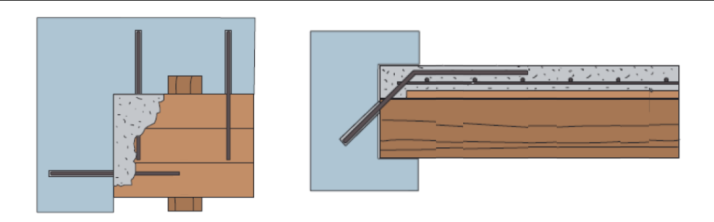
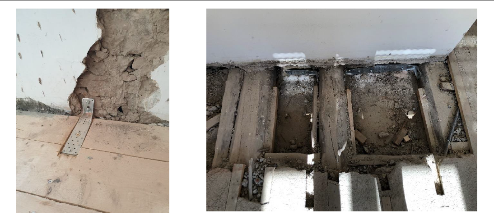
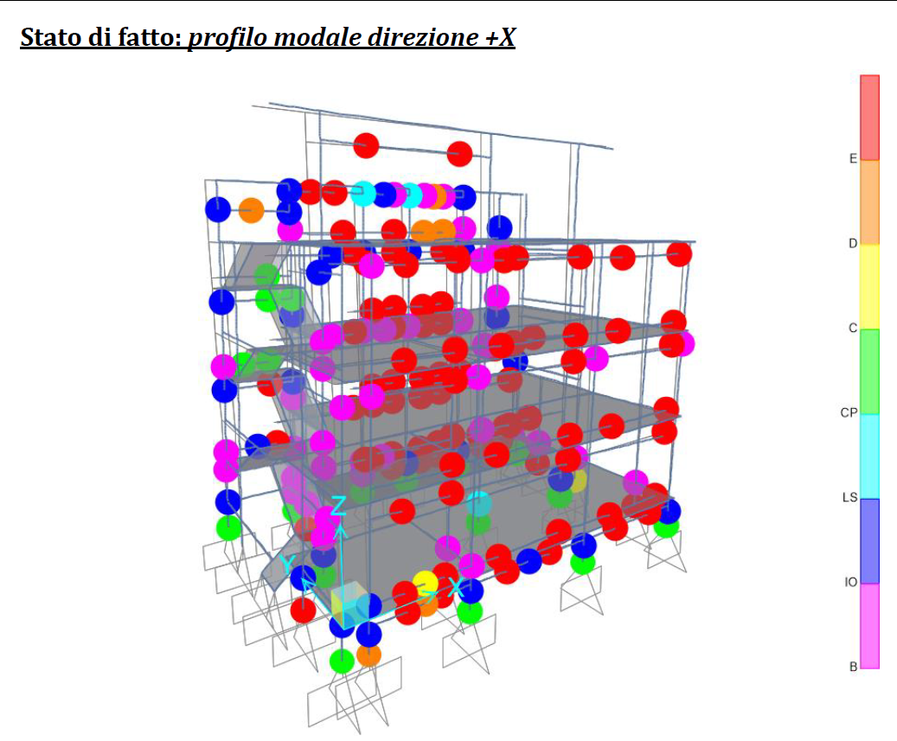
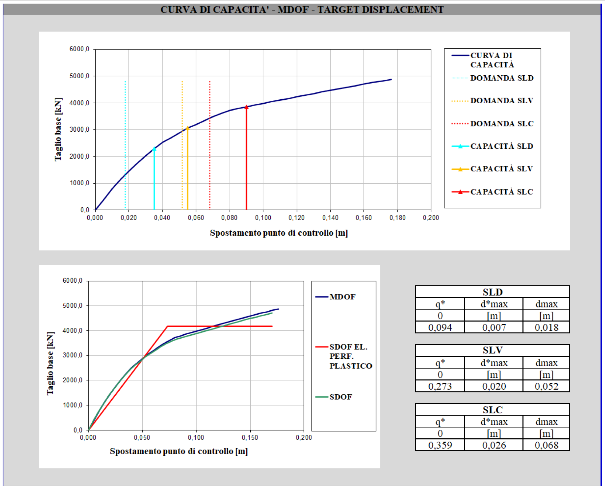
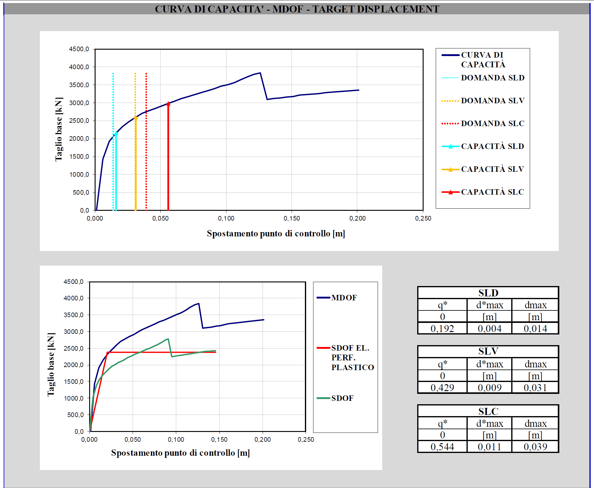

# Valutazione di rischio sismico per un edificio esistente in muratura
    
## Caso Applicativo
Edificio residenziale in muratura risalente al secondo dopo guerra, sito nel centro di Trento.

## Interventi di consolidamento
Calcolo e realizzazione interventi di ammorsamento travi lignee dei solai alla struttura portante

Modellazione e progettazione degli interventi di consolidamento necessari 

Analisi Push-Over

Curve di capacità

