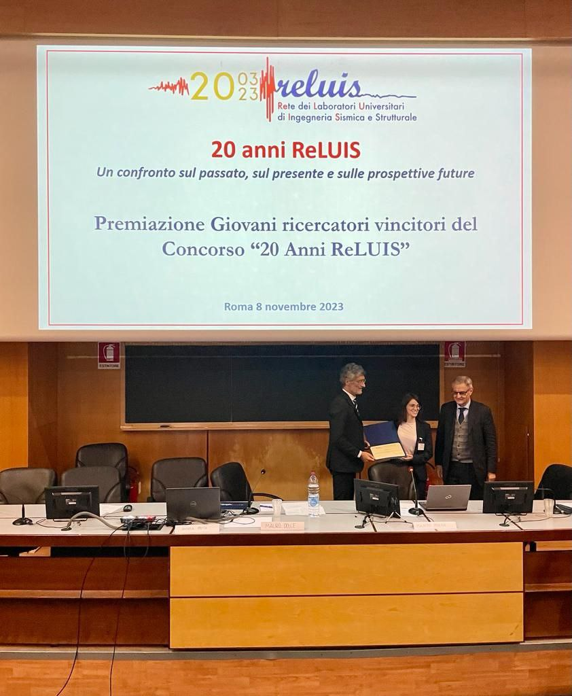
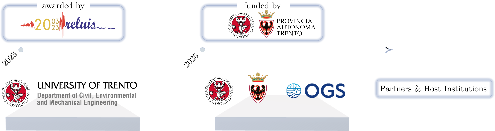
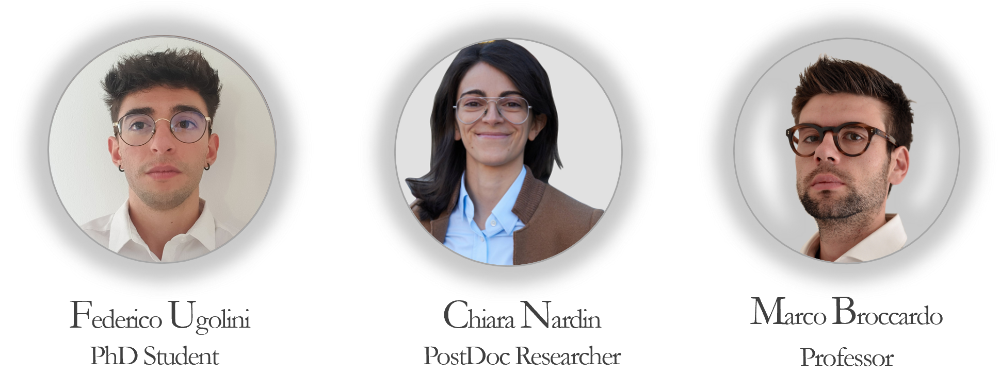

---
linkTitle: MAERS
title: MAERS
date: 2024-01-01
lastmod: 2026-06-17
type: docs  # Using landing instead of docs to avoid the 'publication_types' panic
# Summary for listing cards
summary: "MAERS (Maps of seismic risk and exposure at regional scale) is a project focused on developing integrated seismic risk and exposure maps at a regional scale. The project aims to provide comprehensive and detailed information about seismic hazards, vulnerabilities, and risks in specific regions, helping to inform disaster risk reduction strategies and enhance resilience against seismic events."
build:
  list: always
  render: always

tags: 
- maers
- projects

toc: true
weight: 1
sidebar:
  open: true
--- 

This is the landing page for the **MAERS** project, which stands for **Maps of seismic risk and exposure at regional scale**. The MAERS project is focused on developing integrated seismic risk and exposure maps at a regional scale. The project aims to provide comprehensive and detailed information about seismic hazards, vulnerabilities, and risks in the Alto Garda region, helping to inform disaster risk reduction strategies and enhance resilience against seismic events.

The project was initially financed by the Italian ReLUIS - Rete dei Laboratori Universitari di Ingegneria Sismica, a network of university laboratories in Italy that specialize in seismic engineering research, within the award to young researchers for "20 Years of ReLUIS" anniversary.

*November 8, 2023, Aula Magna of the Faculty of Architecture, Sapienza University of Rome: award ceremony.*

After, the project got funding from the local government of the Autonomous Province of Trento, within the doctoral research program of the University of Trento. 

*Funding, partners and hosting institutions.*

The project is currently hosted in the research group of Prof. [Marco Broccardo](https://www.marco-broccardo.com/), at University of Trento.

Here you can find more information about the project and the ongoing research activities:
- 
  
  
- 
  
  
- 
  
  

and meet the team:

<!-- :bulb: **Quote:** --> 
> [!QUOTE]
> "Qual è quella ruina che nel fianco (/)
> di qua da Trento l’Adice percosse, (/)
> o per tremoto o per sostegno manco, (/)
> che da cima del monte, onde si mosse, (/)
> al piano è sì la roccia discoscesa, (/)
> ch’alcuna via darebbe a chi su fosse..."
*(Inferno XII, 4-9)*
