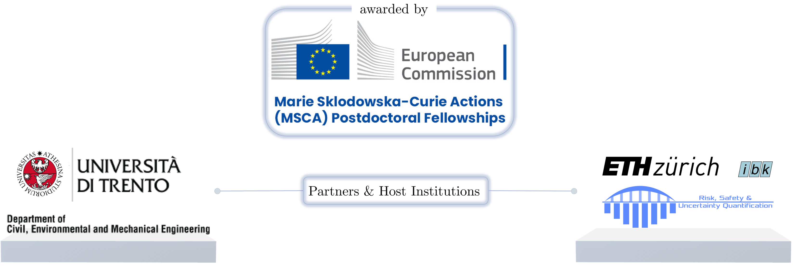

---
linkTitle: REACTIS
title: REACTIS
date: 2025-01-01
type: docs  # Using landing instead of docs to avoid the 'publication_types' panic
# Summary for listing cards
summary: "An open-source tool for automated data analysis."
build:
  list: always
  render: always

tags: 
- reactis
- projects

toc: true
weight: 1
sidebar:
  open: true
--- 

<!-- ## Ciao
Qui provo a scrivere -->

This is the landing page for the **REACTIS** project, which stands for **Seismic Risk Reduction and Adaptation for Complex Time-Dependent Industrial Systems**. Within the framework of the HORIZON [Marie Skłodowska-Curie Actions (MSCA) Postdoctoral Fellowships](https://marie-sklodowska-curie-actions.ec.europa.eu/actions/postdoctoral-fellowships) 2023, this project aims to develop innovative methodologies for <u>seismic risk reduction</u> and <u>adaptation strategies</u> for <u>complex network systems</u>, with a particular focus on industrial facilities. The project will address the challenges posed by <u>uncertainty quantification</u> in seismic hazard and vulnerabilities, as well as the <u>stochastic dynamics</u> of such systems under seismic events. By integrating advanced modeling techniques and data-driven approaches, REACTIS seeks to enhance our understanding of seismic risks and inform effective disaster risk reduction strategies for <u>critical infrastructure</u>.

**Keywords**: *complex network systems; uncertainty quantification; industrial facilities; stochastic dynamics; seismic risk;
adaptation strategies; disaster risk reduction; seismic hazard and vulnerabilities*

This project is hosted at the [Chair of Risk and Safety Engineering](https://sudret.ibk.ethz.ch/) at [ETH Zurich](https://www.ethz.ch/), led by Prof. [Bruno Sudret](https://sudret.ibk.ethz.ch/the-chair/people/prof-dr-bruno-sudret.html) and Dr. [Stefano Marelli](https://sudret.ibk.ethz.ch/the-chair/people/dr-stefano-marelli.html), and at the [HMSDC](https://researchcenter.unitn.it/en/nhmsdc) at University of Trento, led by Prof. [Marco Broccardo](https://www.marco-broccardo.com/) and [Oreste S. Bursi](https://oreste.bursi.dicam.unitn.it/).

*Hosting institutions: ETH Zurich and University of Trento.*

Here you can find more information about the project and the ongoing research activities:

- 
  
  
- 
  
  
- 
  
  

:bulb: **Tip:** Remember to appreciate the little things in life.

<!-- [ehi](../reactis/project-infos)
[ciao](../reactis/reactis-references) -->

<!-- sections:
  - block: markdown
    content:
      title: Project Description
      text: |
        

        
        Adapting to the increasing threat of natural hazards is one of the most pressing current societal issues. Specifically, seismic risk reduction and adaptation of complex intertwined industrial facilities are keys for an effective EU green transition. [Rest of your text...]

- [Project's Infos](/projects/reactis/project-infos/)
- [Related Publications](/projects/reactis/reactis-references/)

    design:
      full_width: true
      columns: '1'

  - block: collection
    content:
      title: Related Publications
      filters:
        folders:
          - publication
        tag: reactis
      text: "Below is a list of publications associated with the REACTIS project."
    design:
      view: table
      full_width: true
--- -->