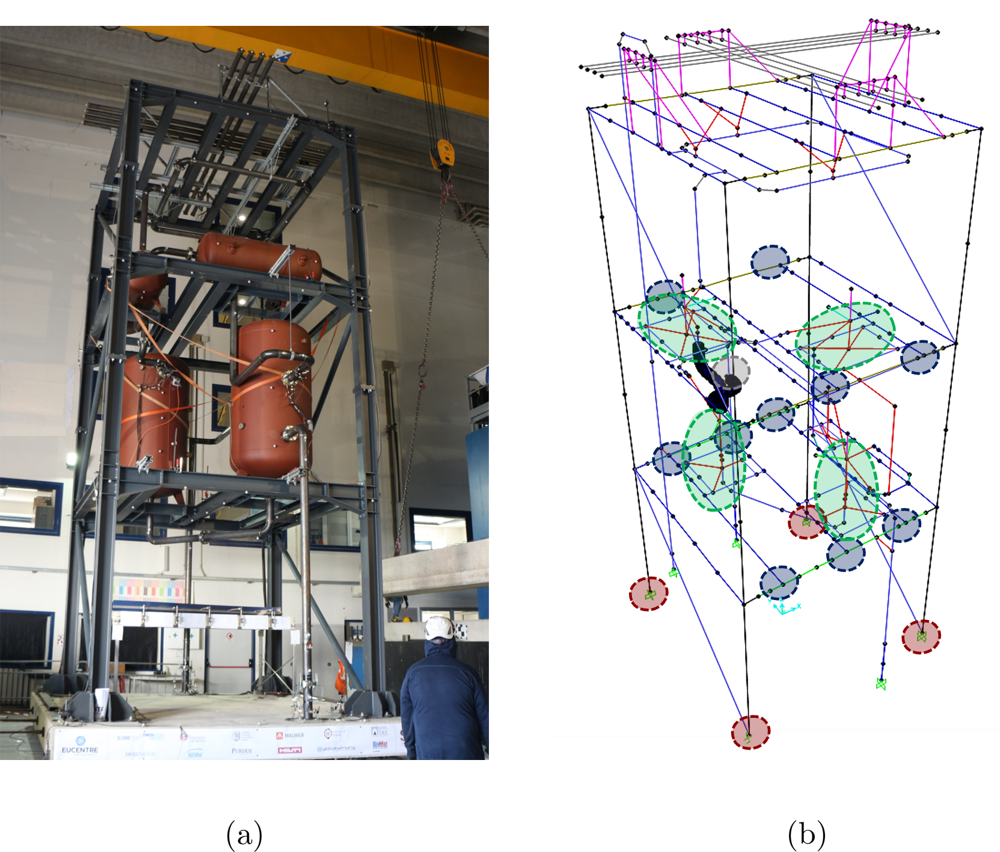

### Project's objectives
The objective of the project [SPIF](https://sera-ta.eucentre.it/shake-table-tests-of-a-special-risk-industrial-facility-at-eucentre-laboratories/) is the holistic investigation of the seismic behaviour of industrial plants equipped with complex process technology by means of shaking table tests.

### Related publications

|Journal Paper|Title|Ref.|
|-------------|-----|----|
| j1.          | AA| [ref](https://sera-ta.eucentre.it/shake-table-tests-of-a-special-risk-industrial-facility-at-eucentre-laboratories/)|

<!---
        links:
  - type: site
    url: https://sera-ta.eucentre.it/shake-table-tests-of-a-special-risk-industrial-facility-at-eucentre-laboratories/
blocks:
  - block: markdown
    content:
      text: |
        The objective of the project is the holistic investigation of the seismic behaviour of industrial plants equipped with complex process technology by means of shaking table tests.

  - block: collection
    view: citation
    content:
      title: Publications
      filters:
        tag: spif
      page_type: publication
      sort_by: date
      sort_ascending: false
---


  
 -->