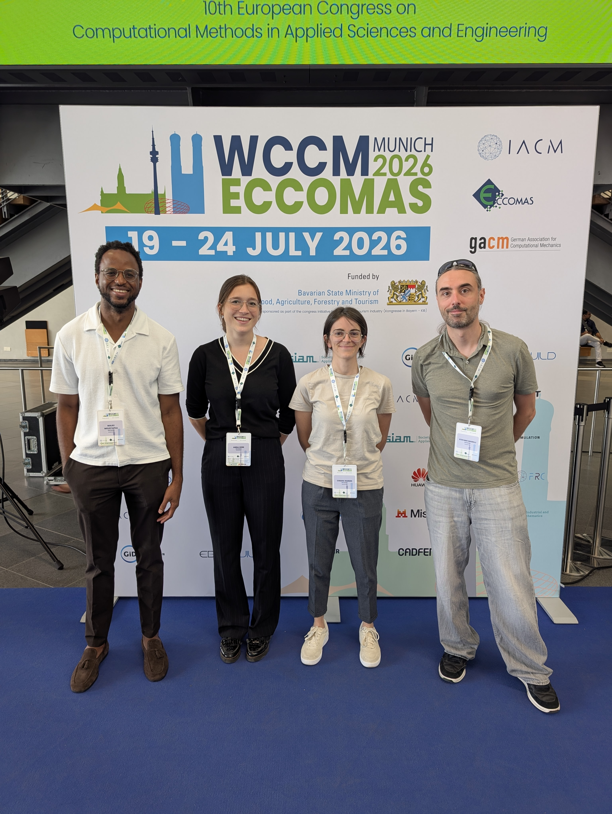

> [!Info]+ WCCM-ECCOMAS 2026
> World Congress on Computational Mechanics — ECCOMAS Congress 2026.  
> Munich, Germany — **19–24 July 2026**.

A very intense week with the RSUQ Chair at **WCCM-ECCOMAS 2026**.

The conference offered a unique opportunity to showcase our latest research at the intersection of **uncertainty quantification, reliability, stochastic modelling, Bayesian inference, and computational mechanics**. We were proud to contribute five presentations spanning several aspects of our work.

## Contributions

🔹 **S. Marelli, S. Schär, C. Nardin & B. Sudret** — *Reliability analysis on dynamical systems using manifold-autoregressive surrogate models*  
The keynote delivered by Stefano explored **mNARX+**, a data-driven framework for modelling complex dynamical systems with evolving internal states and damage, enabling efficient reliability analysis of systems exhibiting non-stationary behaviour.

🔹 **C. Nardin, S. Marelli, M. Broccardo & B. Sudret** — *A Continuous Markov-Chain Perspective on Joint Seismic Reliability and Resilience Assessment*  
In this work, I introduced **continuous-time Markov chains** into the PEER-PBEE framework, providing a unified perspective for modelling both damage and recovery processes and enabling consistent assessment of seismic reliability and resilience.

🔹 **A. Herr, S. Marelli & B. Sudret** — *Introducing Stochastic Emulators for Hierarchical Bayesian Inference of Population Parameters*  
Anna presented a new approach based on **stochastic emulators** that directly approximates population-level responses, reducing the computational burden of hierarchical Bayesian inference for expensive and stochastic forward models.

🔹 **S. Marelli, S. Schär & B. Sudret** — *UQLab – An Open-Source Tool for Uncertainty Quantification with Dynamical Systems*  
Stefano highlighted the latest capabilities of **UQLab**, including its support for time-series data, dynamical systems, and advanced data-driven surrogate models such as **PC-NARX, F-NARX and mNARX+**.

🔹 **Moustapha** — *Reliability-Based Design Optimization with Stochastic Emulators*  
Moustapha's work on **RBDO** demonstrated how stochastic emulators can provide an efficient alternative to classical deterministic surrogates, particularly for high-dimensional uncertainty spaces and intrinsically stochastic simulators.

Together, these contributions reflect the broader research vision of the Chair: developing efficient, scalable and reliable computational methods for uncertainty quantification and risk-informed decision making, while bridging fundamental methodological developments with challenging engineering applications.

Kudos to all the authors and presenters for their excellent work, and many thanks to the **WCCM-ECCOMAS 2026** organizers for bringing together such a vibrant scientific community. It was a pleasure to meet old and new colleagues, discuss new ideas, and see the UQ and computational mechanics communities come together at such an enormous congress.

## Abstract

C. Nardin, S. Marelli, M. Broccardo & B. Sudret —  
**A Continuous Markov-Chain Perspective on Joint Seismic Reliability and Resilience Assessment**  
*WCCM-ECCOMAS 2026*, Munich, July 2026.

[⬇ Download Abstract (PDF)](/papers/2026-WCCM2026-Nardin-REACTIS.pdf)

---

*RSUQ Chair at WCCM-ECCOMAS 2026, Munich — July 2026.*
